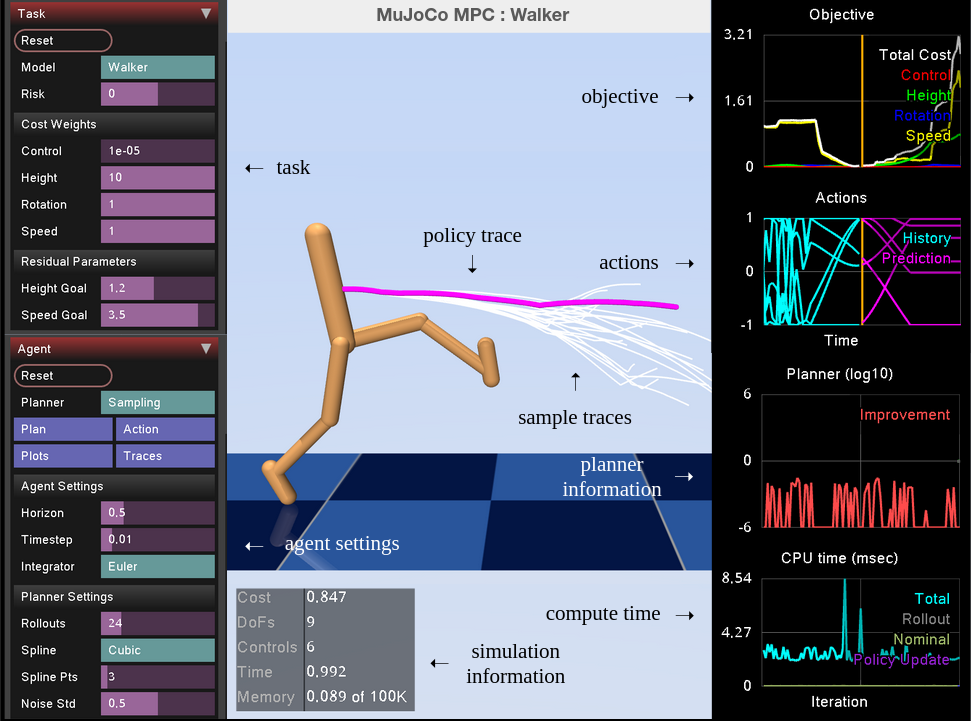

# Graphical User Interface

- [Graphical User Interface](#graphical-user-interface)
  - [Overview](#overview)

## Overview

The MJPC GUI is built on top of MuJoCo's `simulate` application with a few additional features. The below screenshot shows a capture of the GUI for the `walker` task.

